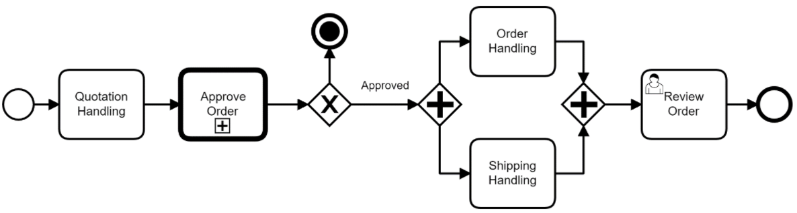

# Especificações do Projeto

Pré-requisitos: <a href="1-Documentação de Contexto.md"> Documentação de Contexto</a>

Definição do problema e ideia de solução a partir da perspectiva do usuário. É composta pela definição do diagrama de personas, histórias de usuários, requisitos funcionais e não funcionais além das restrições do projeto.

Apresente uma visão geral do que será abordado nesta parte do documento, enumerando as técnicas e/ou ferramentas utilizadas para realizar a especificações do projeto

## Personas

|  | Antônio Santos Melo                                                                         |
| ---------------------------------- | ------------------------------------------------------------------------------------------- |
| Idade:                             | 58                                                                                          |
| Ocupação:                          | Médico, Empresário                                                                          |
| História                           | Antônio é formado em medicina, e tem um consultório com 4 funcionários                      |
| Motivações                         | Gosta do seu trabalho, pois percebe potencial para ajudar outras pessoas;                   |
| Frustrações                        | Percebe que os pacientes do seu consultorio passam muito tempo esperando na sala de espera; |

|  | André Araujo Rocha                                                                                    |
| ---------------------------------- | ----------------------------------------------------------------------------------------------------- |
| Idade:                             | 35                                                                                                    |
| Ocupação:                          | Médico                                                                                                |
| História                           | André é formado em medicina e trabalha em uma clinica de procedimentos estéticos.                     |
| Motivações                         | Gosta do seu trabalho, pois percebe potencial para ajudar outras pessoas;                             |
| Frustrações                        | Atende alguns pacientes por videoconferência em aplicativos, porém não consegue organizar documentos, |

|  | João Almeida Pereira                                                                                                                                                                                                      |
| ---------------------------------- | ------------------------------------------------------------------------------------------------------------------------------------------------------------------------------------------------------------------------- |
| Idade:                             | 62                                                                                                                                                                                                                        |
| Ocupação:                          | Aposentado                                                                                                                                                                                                                |
| História                           | João gosta de passar o tempo com sua familia e amigos. Sempre gostou de praticar esportes, mas devido a um problema no coração, não pode mais realizar algumas atividades.                                                |
| Frustrações                        | Devido a um problema de saúde, João tem que se deslocar constantemente até uma clínica que fica distante de sua residência. Ele sabe que é necessário, mas fica estressado devido ao trânsito e ao longo tempo de espera. |

## Histórias de Usuários

Com base na análise das personas forma identificadas as seguintes histórias de usuários:

| EU COMO... `PERSONA` | QUERO/PRECISO ... `FUNCIONALIDADE`                                                                                       | PARA ... `MOTIVO/VALOR`                                                                                                                                                                                             |
| -------------------- | ------------------------------------------------------------------------------------------------------------------------ | ------------------------------------------------------------------------------------------------------------------------------------------------------------------------------------------------------------------- |
| João Almeida Pereira | Quando possível, consultar um especialista no conforto da minha residência.                                              | Moro longe do consultório, e gasto muito tempo no trânsito.                                                                                                                                                         |
| João Almeida Pereira | Enviar uma mensagem de texto ou áudio para o consultório.                                                                | Evitar gastar muito tempo esperando no telefone.                                                                                                                                                                    |
| João Almeida Pereira | Enviar resultados de exames para o especialista pelo aplicativo.                                                         | Moro longe do consultório, e gasto muito tempo no trânsito.                                                                                                                                                         |
| Antônio Santos Melo  | Quando possível, atender seus clientes por videoconferência.                                                             | Agilizar o atendimento aos clientes em seu consultório. Evitar que seus clientes esperem por muito tempo em salas de espera. Melhorar o relacionamento entre cliente/médico. Prestar melhor atendimento ao cliente. |
| André Araujo Rocha   | Ter os documentos dos clientes organizados, garantindo acesso a exames e documentos de clientes de forma simples e ágil. | Ter o acesso a informação de seus clientes de forma agil, para prestar melhor atendimento.                                                                                                                          |

## Modelagem do Processo de Negócio

### Análise da Situação Atual

Apresente aqui os problemas existentes que viabilizam sua proposta. Apresente o modelo do sistema como ele funciona hoje. Caso sua proposta seja inovadora e não existam processos claramente definidos, apresente como as tarefas que o seu sistema pretende implementar são executadas atualmente, mesmo que não se utilize tecnologia computacional.

### Descrição Geral da Proposta

Apresente aqui uma descrição da sua proposta abordando seus limites e suas ligações com as estratégias e objetivos do negócio. Apresente aqui as oportunidades de melhorias.

### Processo 1 – NOME DO PROCESSO

Apresente aqui o nome e as oportunidades de melhorias para o processo 1. Em seguida, apresente o modelo do processo 1, descrito no padrão BPMN.

### Processo 2 – NOME DO PROCESSO

Apresente aqui o nome e as oportunidades de melhorias para o processo 2. Em seguida, apresente o modelo do processo 2, descrito no padrão BPMN.

## Indicadores de Desempenho

Apresente aqui os principais indicadores de desempenho e algumas metas para o processo. Atenção: as informações necessárias para gerar os indicadores devem estar contempladas no diagrama de classe. Colocar no mínimo 5 indicadores.

Usar o seguinte modelo:

Obs.: todas as informações para gerar os indicadores devem estar no diagrama de classe a ser apresentado a posteriori.

## Requisitos

As tabelas que se seguem apresentam os requisitos funcionais e não funcionais que detalham o escopo do projeto. Para determinar a prioridade de requisitos, aplicar uma técnica de priorização de requisitos e detalhar como a técnica foi aplicada.

### Requisitos Funcionais

| ID     | Descrição do Requisito                                                                                                                                 | Prioridade |
| ------ | ------------------------------------------------------------------------------------------------------------------------------------------------------ | ---------- |
| RF-001 | O sistema de permitir o cadastro de clientes.                                                                                                          | ALTA       |
| RF-002 | O sistema de permitir ao cliente cadastrado, acesso a tela de perfil do cliente.                                                                       | ALTA       |
| RF-003 | O sistema de permitir ao cliente, solicitar um agendamento.                                                                                            | ALTA       |
| RF-004 | O sistema deve emitir um recibo, com os dados provenientes do pedido de consulta.                                                                      | MÉDIA      |
| RF-005 | O sistema deve permitir o envio de documentos necessarios ao atendimento.                                                                              | ALTA       |
| RF-006 | O cliente cadastrado, poderá, através do sistema de videoconfêrencia, realizar uma consulta com um especialista em dia e horario previamente agendado. | ALTA       |
| RF-007 | O cliente poderá enviar enviar mensagem de texto ou imagens ao profissional, atravéz do chat.                                                          | BAIXA      |
| RF-008 | O sistema disponibilizará ao paciente, histórico médico eletrônico de consultas                                                                        | MÉDIO      |
| RF-009 | O cliente poderá pesquisar por um profissional, atravéz do campo de pesquisa.                                                                          | ALTA       |
| RF-010 | No perfil de um profissional selecionado, estará disponivel os dias disponiveis para antendimento por videoconferência                                 | ALTA       |
| RF-011 | O usuário do aplicativo poderá alterar sua senha.                                                                                                      | BAIXA      |
| RF-012 | O usuário do aplicativo poderá alterar foto de perfil.                                                                                                 | BAIXA      |

### Requisitos não Funcionais

| ID      | Descrição do Requisito                                                                                     | Prioridade |
| ------- | ---------------------------------------------------------------------------------------------------------- | ---------- |
| RNF-001 | O aplicativo deverá ser desenvolvido utilizando React Native                                               | ALTA       |
| RNF-002 | Deverá ser ultilizada a linguagem Csharp no desenvolvimento do servidor backend                            | ALTA       |
| RNF-003 | Deverá ser ultilizado o banco de dados SQLServer                                                           | ALTA       |
| RNF-004 | O aplicativo deverá estar disponível para aparelhos com sistema Android                                    | ALTA       |
| RNF-005 | O aplicativo deverá estar disponível para aparelhos com sistema IOS                                        | BAIXA      |
| RNF-006 | O aplicativo deverá estar conectado a internet para que seja possivel ultilizar todas suas funcionalidades | MEDIA      |
| RNF-007 | O sistema deverá estar disponível 24 horas por dia, todos os dias da semana                                | MÉDIA      |
| RNF-008 | O aplicativo estará disponivel nas plataformas Google Play e App Store                                     | ALTA       |

## Restrições

O projeto está restrito pelos itens apresentados na tabela a seguir.

| ID  | Restrição                                    |
| --- | -------------------------------------------- |
| 01  | O projeto deverá ser entregue até 04/12/2023 |

## Diagrama de Casos de Uso

O diagrama de casos de uso é o próximo passo após a elicitação de requisitos, que utiliza um modelo gráfico e uma tabela com as descrições sucintas dos casos de uso e dos atores. Ele contempla a fronteira do sistema e o detalhamento dos requisitos funcionais com a indicação dos atores, casos de uso e seus relacionamentos.

As referências abaixo irão auxiliá-lo na geração do artefato “Diagrama de Casos de Uso”.

 

 

##### _Figura 1- Diagrama de casos de uso_

# Matriz de Rastreabilidade

|         | RF-001 | RF-002 | RF-003 | RF-004 | RF-005 | RF-006 | RF-007 | RF-008 | RF-009 | RF-0010 | RF-0011 | RF-0012 |
| ------- | ------ | ------ | ------ | ------ | ------ | ------ | ------ | ------ | ------ | ------- | ------- | ------- |
| cliente | x      | x      | x      |        |        |        |        |        |        | x       | x       | x       |
| RF-001  |        |        |        |        |        |        |        |        |        |         |         |         |
| RF-002  |        |        |        |        |        |        |        |        |        |         |         |         |
| RF-003  |        |        |        |        |        |        |        |        |        |         |         |         |
| RF-004  |        |        | x      |        |        |        |        |        |        |         |         |         |
| RF-005  |        |        | x      |        |        | x      |        |        |        |         |         |         |
| RF-006  |        |        | x      | x      |        |        |        |        |        |         |         |         |
| RF-007  |        |        |        |        |        |        |        |        |        |         |         |         |
| RF-008  |        |        | x      | x      |        | x      |        |        |        |         |         |         |
| RF-009  |        |        | x      |        |        | x      |        |        |        |         |         |         |
| RF-010  |        |        | x      |        |        |        |        |        |        |         |         |         |
| RF-011  |        |        |        |        |        |        |        |        |        |         |         |         |

# Gerenciamento de Projeto

De acordo com o PMBoK v6 as dez áreas que constituem os pilares para gerenciar projetos, e que caracterizam a multidisciplinaridade envolvida, são: Integração, Escopo, Cronograma (Tempo), Custos, Qualidade, Recursos, Comunicações, Riscos, Aquisições, Partes Interessadas. Para desenvolver projetos um profissional deve se preocupar em gerenciar todas essas dez áreas. Elas se complementam e se relacionam, de tal forma que não se deve apenas examinar uma área de forma estanque. É preciso considerar, por exemplo, que as áreas de Escopo, Cronograma e Custos estão muito relacionadas. Assim, se eu amplio o escopo de um projeto eu posso afetar seu cronograma e seus custos.

## Gerenciamento de Tempo

Com diagramas bem organizados que permitem gerenciar o tempo nos projetos, o gerente de projetos agenda e coordena tarefas dentro de um projeto para estimar o tempo necessário de conclusão.

O gráfico de Gantt ou diagrama de Gantt também é uma ferramenta visual utilizada para controlar e gerenciar o cronograma de atividades de um projeto. Com ele, é possível listar tudo que precisa ser feito para colocar o projeto em prática, dividir em atividades e estimar o tempo necessário para executá-las.

## Gerenciamento de Equipe

O gerenciamento adequado de tarefas contribuirá para que o projeto alcance altos níveis de produtividade. Por isso, é fundamental que ocorra a gestão de tarefas e de pessoas, de modo que os times envolvidos no projeto possam ser facilmente gerenciados.

## Gestão de Orçamento

O processo de determinar o orçamento do projeto é uma tarefa que depende, além dos produtos (saídas) dos processos anteriores do gerenciamento de custos, também de produtos oferecidos por outros processos de gerenciamento, como o escopo e o tempo.

