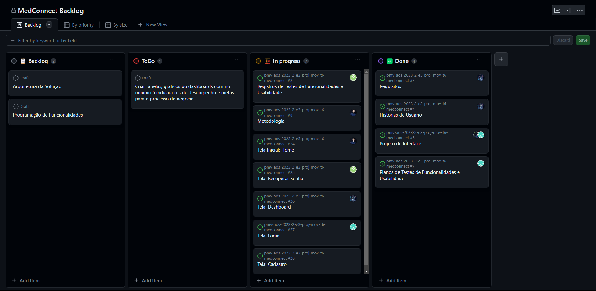

# Metodologia

A metodologia contempla as definições de ferramentas utilizadas pela equipe tanto para a manutenção dos códigos e demais artefatos quanto para a organização do time na execução das tarefas do projeto.

## Relação de Ambientes de Trabalho

Os artefatos do projeto serão desenvenvolvidos a partir das plataformas GitHub e Figma, e a relação dos ambientes está apresentada na tabela abaixo.

| Ambiente                    | Plataforma      | Link de acesso                                                                                                                                                                                          |
| --------------------------- | --------------- | ------------------------------------------------------------------------------------------------------------------------------------------------------------------------------------------------------- |
| Repositório de código fonte | GitHub          | https://github.com/ICEI-PUC-Minas-PMV-ADS/pmv-ads-2023-2-e3-proj-mov-t6-medconnect                                                                                                                      |
| Design de Interfaces        | Figma           | https://www.figma.com/file/kGIjQ2TGmn4WwBt9hC5kIB/Projeto?type=design&node-id=309-778&mode=design&t=dEisix9duEvlRzDV-0                                                                                  |
| Gerenciamento do Projeto    | GitHub          | https://github.com/orgs/ICEI-PUC-Minas-PMV-ADS/projects/525                                                                                                                                             |
| Comunicação e Reuniões      | Microsoft Teams | https://teams.microsoft.com/l/channel/19%3a8jT2jFJBpphTKOlEs4r1Vp90dsyvSWMtrWfcWSk8DT81%40thread.tacv2/Geral?groupId=5fb8c0de-b61a-4186-99bb-e5379d1837c5&tenantId=14cbd5a7-ec94-46ba-b314-cc0fc972a161 |

## Controle de Versão

Para a gestão do código fonte será utilizado o modelo de processo baseado no Git Flow, como mostrado na figura a seguir:

_Figura 1 - Fluxo de controle do código fonte_

A ferramenta de controle de versão adotada no projeto foi o [Git](https://git-scm.com/), sendo que o [Github](https://github.com/) foi utilizado para hospedagem do repositório.

O projeto segue a seguinte convenção para o nome de branches:

- `main`: versão estável já testada do software
- `unstable`: versão já testada do software, porém instável
- `testing`: versão em testes do software
- `dev`: versão de desenvolvimento do software

Quanto à gerência de issues, o projeto adota a seguinte convenção para etiquetas:

- `bug`: Indica um problema inesperado ou comportamento involuntário
- `duplicate`: Indica problemas, pull requests ou discussões
- `help wanted`: Indica que um mantenedor deseja ajudar em um problema ou uma pull request
- `enhancement`: uma funcionalidade precisa ser melhorada
- `invalid`: Indica que um problema, pull request ou discussão já não é relevante
- `documentation`: melhorias ou acréscimos à documentação
- `question`: Indica que um problema, pull request ou discussão precisa de mais informações
- `bug`: uma funcionalidade encontra-se com problemas
- `feature`: uma nova funcionalidade precisa ser introduzida
- `wontfix`: Indica que o trabalho não continuará em um problema, pull request ou discussão

## Gerenciamento de Projeto

- - ### [Divisão de Papéis](https://github.com/pauloosilas/sus_online/blob/main/docs/03-Metodologia.md#divisão-de-papéis)

    A equipe está organizada da seguinte forma:

    - Scrum Master:
      - Paulo Silas Barbosa Bandeira
    - Product Owner:
      - Samuel Ferreira de Oliveia
    - Equipe de Desenvolvimento:
      - Frederico Goncalves da Silva Junior
      - Lucas Delmasquio Silva
    - Equipe de Design:
      - Nicolas Patrick Teixeira Da Silva

### Processo

A ferramenta "projects" do GitHub está sendo utilizada para a organização e distribuição de tarefas e estruturada com as seguintes listas:

- `Backlog`: recebe as tarefas a serem trabalhadas e representa o Product Backlog. Todas as atividades identificadas no decorrer do projeto também devem ser incorporadas a esta lista.

- `To Do`: Esta lista representa o Sprint Backlog. Este é o Sprint atual que estamos trabalhando.

- `In progress`: Quando uma tarefa tiver sido iniciada, ela é movida para esta coluna.

- `Done`: nesta lista são colocadas as tarefas que passaram pelos testes e controle de qualidade e estão prontos para ser entregues ao usuário. Não há mais edições ou revisões necessárias.

  
  

_Figura 01: Project Backlog_

### Ferramentas

As ferramentas empregadas no projeto são:

- GitHub
- Git
- VS Code
- Visual Studio
- Figma
- React-Native
- Node.Js
- Microsoft .NET CORE
- Typescript
- Csharp
