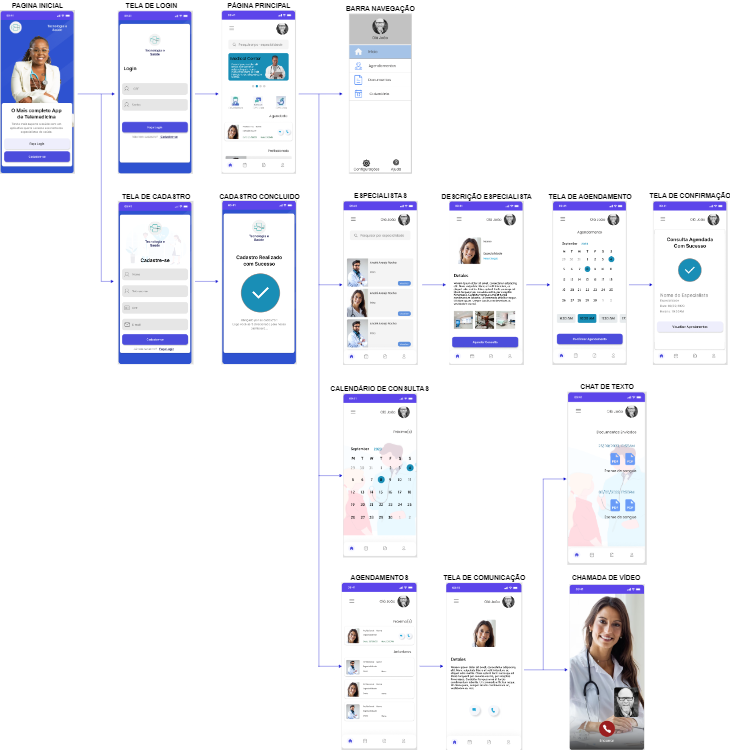
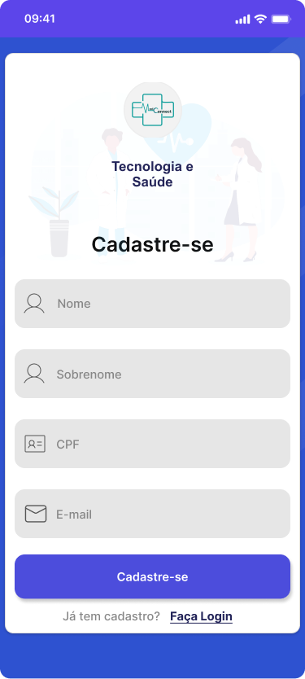
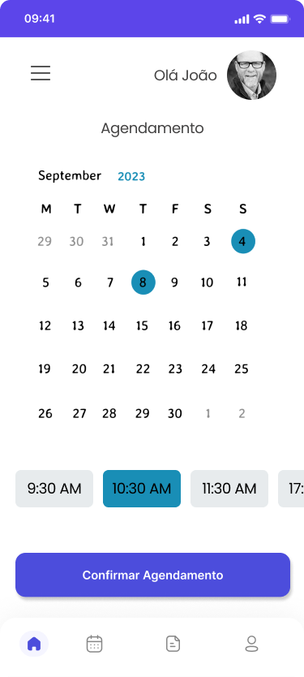
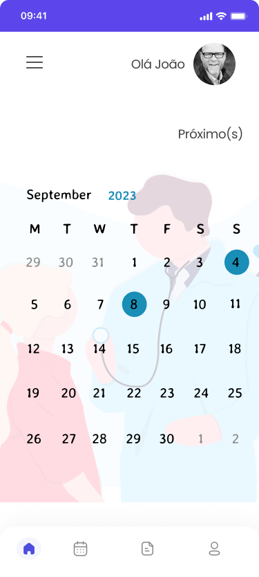
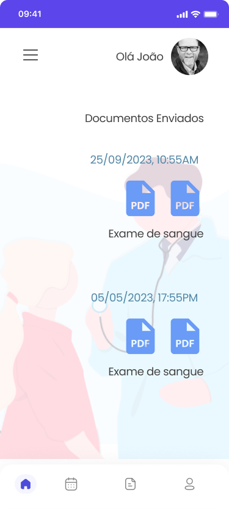
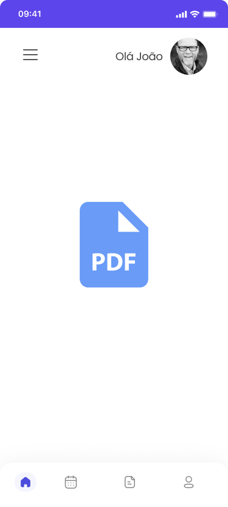

# Projeto de Interface

Visão geral da interação do usuário pelas telas do sistema e protótipo interativo das telas com as funcionalidades que fazem parte do sistema (wireframes).

Apresente as principais interfaces da plataforma. Discuta como ela foi elaborada de forma a atender os requisitos funcionais, não funcionais e histórias de usuário abordados nas <a href="2-Especificação do Projeto.md"> Documentação de Especificação</a>.

## Diagrama de Fluxo

O diagrama apresenta o estudo do fluxo de interação do usuário com o sistema interativo e muitas vezes sem a necessidade do desenho do design das telas da interface. Isso permite que o design das interações seja bem planejado e gere impacto na qualidade no design do wireframe interativo que será desenvolvido logo em seguida.

    

## Wireframes / Prototipos

<table >
    <tr >
       <th>Tela Inicial</th>
       <th>Tela de Login</th>
       <th>Tela de Cadastro</th>
    </tr>
    <tr>
    <td width="300" >
         
    </td>
    <td width="300" >
         
    </td>
    <td width="300" >
        
    </td>
    </tr>
</table>

<table>
    <tr>
       <th>Modal/Tela Cadastro realizado com sucesso</th>
       <th>Tela Dashboard</th>
       <th>Tela com Resultado de Pesquisas</th>
    </tr>
    <tr>
    <td width="300" >
         
    </td>
    <td width="300" >
         
    </td>
    <td width="300" >
       
    </td>
    </tr>
</table>

<table>
    <tr>
       <th>Perfil do Profissional</th>
       <th>Tele de Agendamento</th>
       <th>Modal/Tela Agendamento Realizado com Sucesso</th>
    </tr>
    <tr>
    <td width="300" >
         
    </td>
    <td width="300" >
         
    </td>
    <td width="300" >
        
    </td>
    </tr>
</table>

<table>
    <tr>
       <th>Historico de Consultas</th>
       <th>Calendário</th>
       <th>Tela de Consulta</th>
    </tr>
    <tr>
    <td width="300" >
        
    </td>
    <td width="300" >
         
    </td>
    <td width="300" >
        
    </td>
    </tr>
</table>

<table>
    <tr>
       <th>Tela envio de documentos</th>
       <th>Tela para leitura de documentos</th>
       <th>Tela Recuperar Senha</th>
    </tr>
    <tr>
    <td width="300" >
       
    </td>
    <td width="300" >
        
    </td>
    <td width="300" >
       
    </td>
    </tr>
</table>
