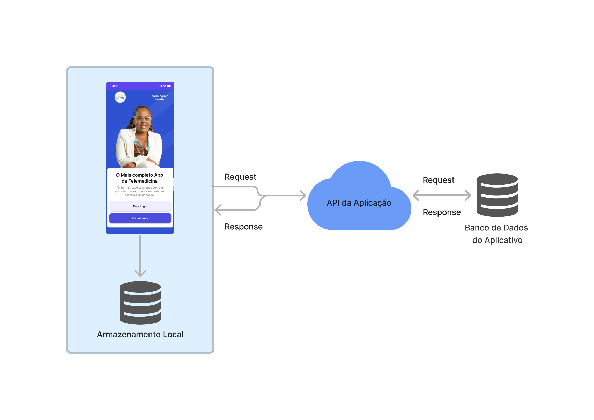
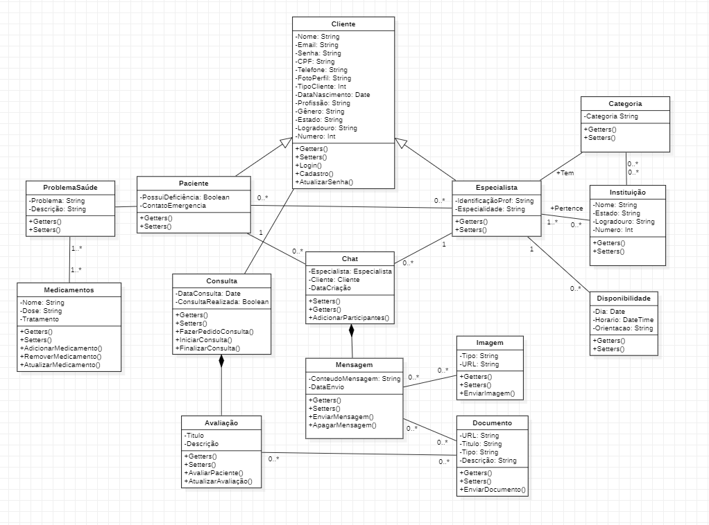

# Arquitetura da Solução

   O aplicativo será construído utilizando o framework React-Native, e consumirá dados de uma API, que será construída utilizando a arquitetura do framework .NET e linguagem CSharp.
    
    
    

      A API será hospedada na plataforma de computação em nuvem Microsoft Azure, e utilizará o banco de dados SQLServer para leitura e armazenamento de dados.

   Um token de autorização, Json Web Token(JWT), será armazenado em localstorage da aplicação.

## Diagrama de Classes

O diagrama de classes ilustra graficamente como será a estrutura do software, e como cada uma das classes da sua estrutura estarão interligadas. Essas classes servem de modelo para materializar os objetos que executarão na memória.

 

 

##### _Figura 1- Diagrama de casos de uso_

## Modelo ER (Projeto Conceitual)

O Modelo ER representa através de um diagrama como as entidades (coisas, objetos) se relacionam entre si na aplicação interativa.]

 

 

##### _Figura 2- Modelo Conseitual_

## Esquema Relacional

O Esquema Relacional corresponde à representação dos dados em tabelas juntamente com as restrições de integridade e chave primária.

 

 

##### _Figura 2- Esquema Relacional_

## Modelo Físico

Entregar um arquivo banco.sql contendo os scripts de criação das tabelas do banco de dados. Este arquivo deverá ser incluído dentro da pasta src\bd.

## Tecnologias Utilizadas

- Node.js
- React-Native
- Typescript
- CSharp
- .NET Framework
- SQLServer 2019
- Microsoft Visual Code
- Microsoft Visual Studio

## Hospedagem

A API do sistema, assim como o banco de dados será hospedada nos servidores da plataforma de computação em nuvem Microsoft Azure.

O aplicativo será disponibilizado nos principais marketplaces para dispositivos moveis.

## Qualidade de Software Para o Sistema de Telemedicina

#### Funcionalidade:

Adequação: Garantir que o aplicativo seja adequado para as tarefas de telemedicina, como consulta médica, prescrição de medicamentos e acompanhamento de pacientes.

Interoperabilidade: Assegurar que o aplicativo possa se integrar facilmente com outros sistemas e dispositivos médicos, permitindo a troca de informações essenciais.

#### Confiabilidade:

Disponibilidade: Garantir que o aplicativo esteja disponível quando necessário, para que os pacientes possam acessar serviços de telemedicina sem interrupções significativas.

Tolerância a falhas: Minimizar interrupções causadas por falhas no sistema, assegurando a continuidade das operações de telemedicina.
Usabilidade:

Compreensibilidade: Tornar o aplicativo fácil de entender para médicos e pacientes, com uma interface intuitiva.

Eficiência de uso: Garantir que o aplicativo permita que médicos realizem consultas de forma eficiente, minimizando o tempo gasto em tarefas administrativas.

#### Eficiência de Desempenho:

Desempenho: Assegurar que o aplicativo funcione de maneira rápida e eficiente, especialmente durante chamadas de vídeo ou outras interações em tempo real.

Utilização de recursos: Garantir que o aplicativo utilize os recursos do dispositivo de forma eficiente para evitar lentidão ou travamentos.
Segurança:

Confidencialidade: Proteger as informações de saúde dos pacientes contra acesso não autorizado.
Integridade: Garantir que os dados não sejam corrompidos ou alterados indevidamente.

Disponibilidade: Proteger o aplicativo contra ataques que possam torná-lo inacessível.

#### Manutenibilidade:

Modificabilidade: Facilitar a manutenção e atualização do aplicativo à medida que novas necessidades ou regulamentações surgem na área da telemedicina.

#### Portabilidade:

Adaptabilidade: Permitir que o aplicativo seja utilizado em diferentes dispositivos e ambientes, como smartphones, tablets e computadores, mantendo a consistência na experiência do usuário.

#### Compatibilidade:

Coexistência: Garantir que o aplicativo seja compatível com outros sistemas e dispositivos médicos comuns.
