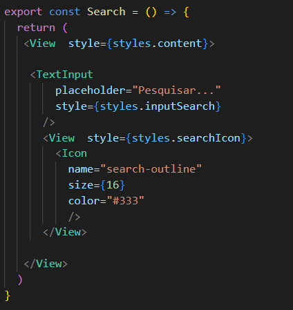

# Programação de Funcionalidades

## Tela Home

<table>
    <tr>
       <th>Tela Home</th>
       <th><a href="https://github.com/ICEI-PUC-Minas-PMV-ADS/pmv-ads-2023-2-e3-proj-mov-t6-medconnect/blob/main/src/medconnect-expo/src/screens/Home/HomeScreen.tsx">Link do Código Fonte</a></th>       
    </tr>
    <tr>
    <td width="300" >
        

_Figura 01 - tela Home_

</td>
<td width="300" >
<a href="https://github.com/ICEI-PUC-Minas-PMV-ADS/pmv-ads-2023-2-e3-proj-mov-t6-medconnect/blob/main/src/medconnect-expo/src/screens/Home/HomeScreen.tsx">Link do Código Fonte</a>
</td>
</tr>

</table>

## Tela Login

<table>
    <tr>
       <th>Tela Login</th>
       <th><a href="https://github.com/ICEI-PUC-Minas-PMV-ADS/pmv-ads-2023-2-e3-proj-mov-t6-medconnect/blob/main/src/medconnect-expo/src/screens/Login/Login.tsx">Link do Código Fonte</a></th>       
    </tr>
    <tr>
    <td width="300" >
        

_Figura 02 - tela Login_

</td>
<td width="300" >
<a href="https://github.com/ICEI-PUC-Minas-PMV-ADS/pmv-ads-2023-2-e3-proj-mov-t6-medconnect/blob/main/src/medconnect-expo/src/screens/Login/Login.tsx">Link do Código Fonte</a>
</td>
</tr>

</table>

## Tela Recuperar Senha

<table>
    <tr>
       <th>Tela Recuperar Senha</th>
       <th><a href="https://github.com/ICEI-PUC-Minas-PMV-ADS/pmv-ads-2023-2-e3-proj-mov-t6-medconnect/blob/main/src/medconnect-expo/src/screens/RecoverPassword/RecoverPassword.tsx">Link do Código Fonte</a></th>       
    </tr>
    <tr>
    <td width="300" >
        

_Figura 03 - tela Recuperar Senha_

</td>
<td width="300" >
<a href="https://github.com/ICEI-PUC-Minas-PMV-ADS/pmv-ads-2023-2-e3-proj-mov-t6-medconnect/blob/main/src/medconnect-expo/src/screens/Login/Login.tsx">Link do Código Fonte</a>
</td>
</tr>

</table>

## Tela Cadastro

<table>
    <tr>
       <th>Tela Cadastro</th>
       <th><a href="https://github.com/ICEI-PUC-Minas-PMV-ADS/pmv-ads-2023-2-e3-proj-mov-t6-medconnect/blob/main/src/medconnect-expo/src/screens/Register/Register.jsx">Link do Código Fonte</a></th>       
    </tr>
    <tr>
    <td width="300" >
        

_Figura 04 - tela Cadastro_

</td>
<td width="300" >
<a href="https://github.com/ICEI-PUC-Minas-PMV-ADS/pmv-ads-2023-2-e3-proj-mov-t6-medconnect/blob/main/src/medconnect-expo/src/screens/Register/Register.jsx">Link do Código Fonte</a>
</td>
</tr>

</table>

## Dashboard

### Tela Principal

<table>
    <tr>
       <th>Tela Dashboard</th>
       <th><a href="https://github.com/ICEI-PUC-Minas-PMV-ADS/pmv-ads-2023-2-e3-proj-mov-t6-medconnect/blob/main/src/medconnect-expo/src/screens/Dashboard/Dashboard.tsx">Link do Código Fonte</a></th>       
    </tr>
    <tr>
    <td width="300" >
       

_Figura 05 - tela Dashboard_

</td>
<td width="300" >
<a href="https://github.com/ICEI-PUC-Minas-PMV-ADS/pmv-ads-2023-2-e3-proj-mov-t6-medconnect/blob/main/src/medconnect-expo/src/screens/Dashboard/Dashboard.tsx">Link do Código Fonte</a></th>

</td>
</tr>

</table>

<table>
    <tr>
       <th>Barra de pesquisa</th>
       <th><a href="https://github.com/pauloosilas/pmv-ads-2023-2-e3-proj-mov-t6-medconnect/blob/main/src/medconnectapp/src/components/Search/Search.tsx">Link do Código Fonte</a></th>       
    </tr>
    <tr>
    <td width="300" >
        

_Figura 06 - Barra de Pesquisa_

</td>
<td width="300" >

_Figura 07 - Codigo fonte_

</td>
</tr>

</table>
