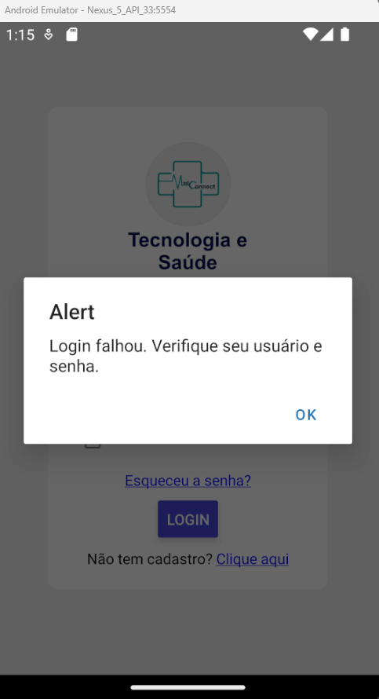
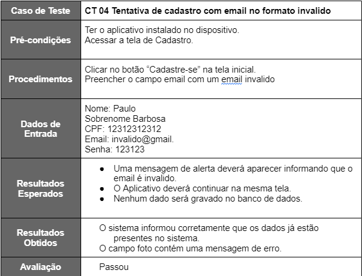

# Registro de Testes de Software

Pré-requisitos: <a href="3-Projeto de Interface.md"> Projeto de Interface</a>, <a href="8-Plano de Testes de Software.md"> Plano de Testes de Software</a>

Relatório com as evidências dos testes de software realizados no sistema pela equipe, baseado em um plano de testes pré-definido.

### Teste 01: Acessar o sistema com usuário ou senha invalido(a).

 

_Figura 01 - Caso de Teste 01 - login inválido_

##### Registro do Teste 01.

_Figura 02 - Registro do Teste 01 - login inválido_

### Teste 02: Tentativa de login, sem informar dados.

 

_Figura 03 - Caso de Teste 02 campos vazios_

### Registro do Teste 02.

 

_Figura 04 - Registro do Teste 02, campos vazios_

### Teste 03, Senha Com Menos de 6 caracteres.

 

_Figura 05 - Senha com menos de 6 caracteres_

### Registro do Teste 03.

 

_Figura 05 - Senha com menos de 6 caracteres_

### Teste 04, Tentativa de Cadastro Com Email Invalido.

 

_Figura 06 - Email Invalido_

### Registro do Teste 04.

 

_Figura 07 - Registro de caso de Teste 04_

### Teste 05, Tentativa de Agendamento de Consulta sem Informar Dados.

 

_Figura 08 - Teste 5_

### Registro do Teste 05.

 

_Figura 09 - Registro de caso de Teste 05_
